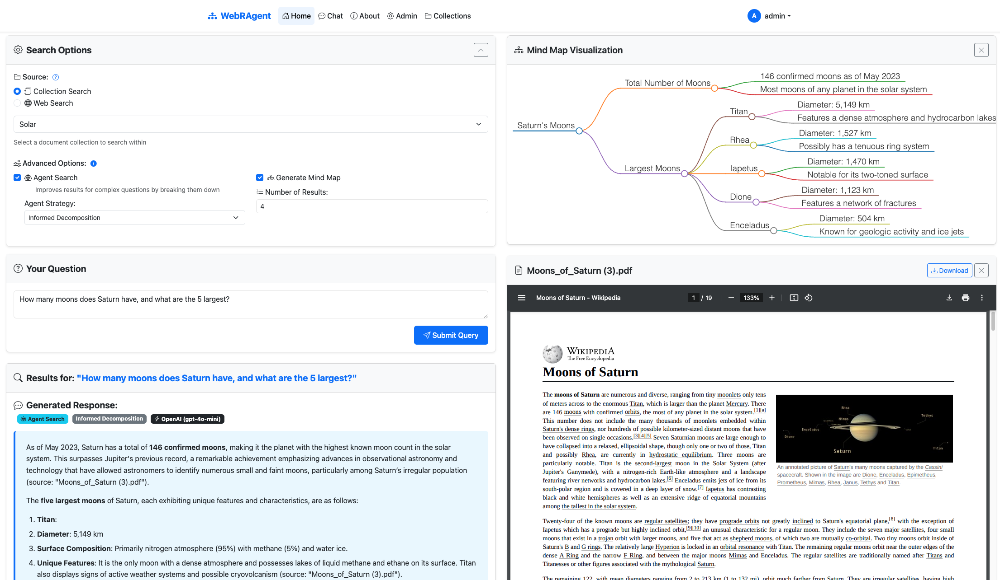
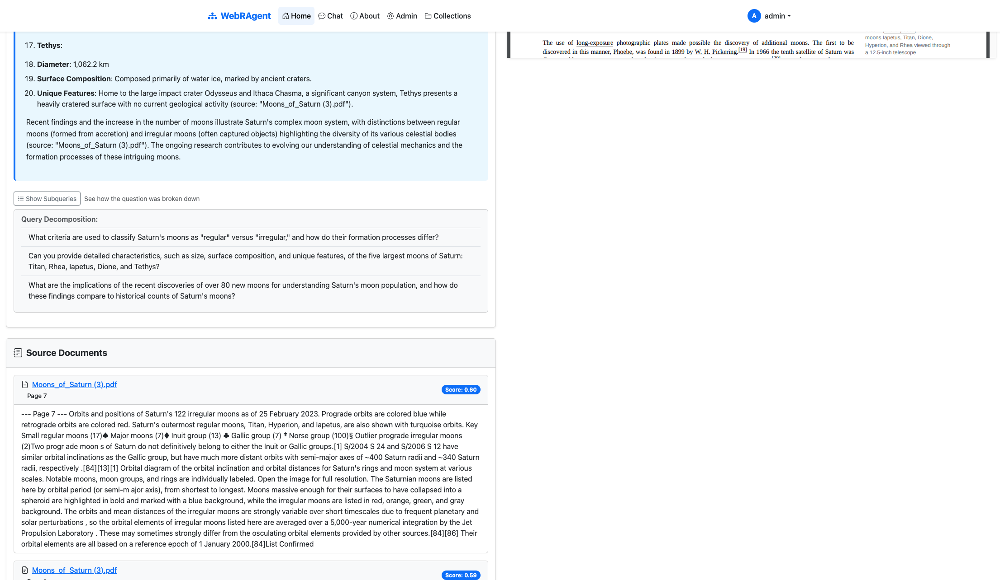
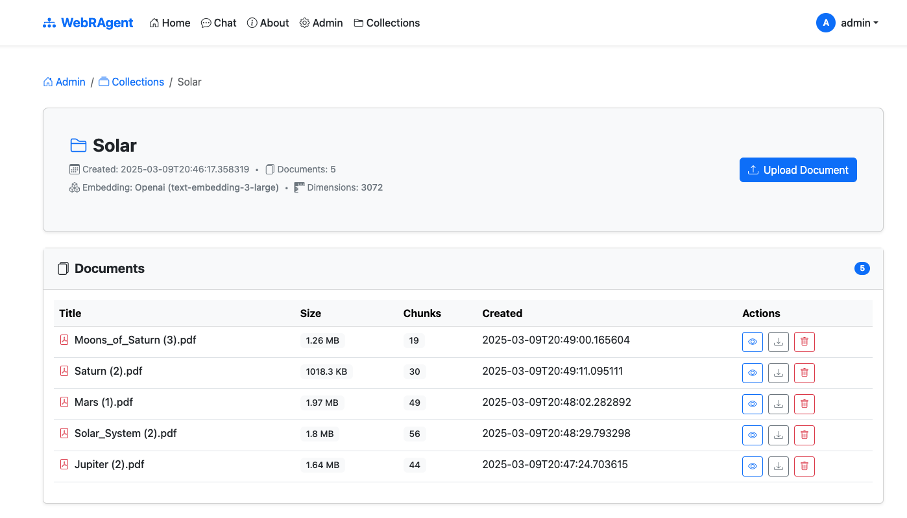
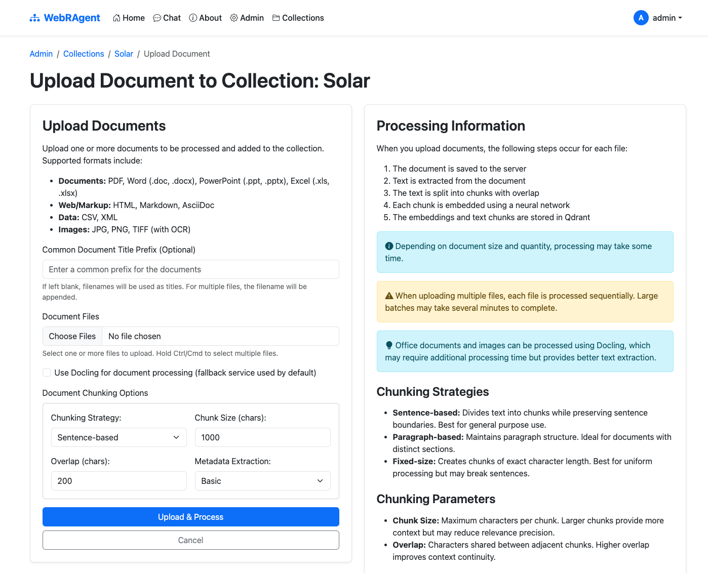

# 🔍 WebRAgent

A Retrieval-Augmented Generation (RAG) web application built with Flask and Qdrant.

© 2024 Dennis Kruyt. All rights reserved.

## Introduction

**WebRAgent** is a powerful Retrieval-Augmented Generation system that merges Large Language Models (LLMs) with a vector database (Qdrant) to provide contextually rich answers to user queries. By offering various search modes—including **Collection Search** for internal documents, **Web Search** via SearXNG, and a more comprehensive **Deep Web Search**—WebRAgent ensures you can find the information you need quickly and thoroughly. For more complex questions, WebRAgent’s **Agent Search** functionality breaks down queries into sub-problems and compiles a holistic answer. You can also visualize the relationships between concepts using the built-in **Mind Map** generator. 

If you prefer to keep your LLM-powered workflows completely private and self-contained, you can integrate Ollama into WebRAgent. Ollama runs entirely on your local machine.

## 📷 Screenshots

### Search


### Context


### Collections


### Upload


## 📋 Overview

This application implements a RAG system that combines the power of Large Language Models (LLMs) with a vector database (Qdrant) to provide context-enhanced responses to user queries. It features:

- 💬 User query interface for asking questions  
- 🔐 Admin interface for managing document collections  
- 📄 Document processing and embedding  
- 🤖 Integration with multiple LLM providers (OpenAI, Claude, Ollama)

## ✨ Features

### Collection Search
Search within your **document collections** for relevant information. Simply select a specific collection from the dropdown menu to limit queries to that collection’s contents.

### Web Search
Search the internet for information using **SearXNG**. This option fetches search results from various search engines and synthesizes them with LLMs for a comprehensive answer.

### Deep Web Search
An **enhanced web search** that scrapes and processes the full content of web pages to extract more detailed information. This option:
- Retrieves search results from the web  
- Scrapes the full content of each page  
- Analyzes the content to extract relevant information  
- Takes longer to process but provides more **comprehensive** results  

### Agent Search
Enhances the search process by breaking down complex questions into smaller, more focused sub-queries:
- Analyzes your question to identify key components  
- Creates targeted sub-queries for each component  
- Processes each sub-query separately  
- Synthesizes a comprehensive answer from all results  
- Particularly useful for **multi-part questions**  

#### Agent Strategies
- **Direct Decomposition**: Immediately breaks your query down into sub-queries before searching  
- **Informed Decomposition**: First performs a preliminary search, then creates targeted follow-up queries based on initial findings  

### Generate Mind Map
Automatically creates a **visual mind map** representing the answer, helping you understand the relationships between concepts at a glance.

### Number of Results
Controls how many source documents or web pages will be used to generate the answer. Increasing this number can provide a more thorough overview but may increase processing time.

### Additional Highlights
- 🖥️ **User Interface**: A clean, intuitive interface to submit queries and receive LLM responses  
- 🔎 **Vector Search**: Retrieve relevant document snippets based on semantic similarity  
- 👤 **Admin Interface**: Securely manage collections and upload documents  
- 📝 **Document Processing**: Automatically extract text, chunk, embed, and store documents  
- 🧠 **Multiple LLM Support**: Configure your preferred LLM provider (OpenAI, Claude, Ollama)  
- 🔍 **Dynamic Embedding Models**: Automatically detects and uses available embedding models from all configured providers  

## 📋 Prerequisites

- 🐍 Python 3.8+  
- 🗄️ [Qdrant](https://qdrant.tech/documentation/quick-start/) running locally or remotely  
- 🔑 API keys for your chosen LLM provider  

## 🚀 Installation

### 💻 Option 1: Local Installation

1. **Clone the repository**:
   ```bash
   git clone https://github.com/dkruyt/WebRAgent.git
   cd WebRAgent
   ```

2. **Create and activate a virtual environment**:
   ```bash
   python -m venv venv
   source venv/bin/activate  # On Windows: venv\Scripts\activate
   ```

3. **Install dependencies**:
   ```bash
   pip install -r requirements.txt
   ```

4. **Copy the example environment file and configure it**:
   ```bash
   cp .env.example .env
   ```
   Then edit the `.env` file with your preferred settings. For example:
   ```
   # API Keys for LLM Providers (uncomment and add your keys for the providers you want to use)
   # At least one provider should be configured
   #OPENAI_API_KEY=your_openai_api_key_here
   #CLAUDE_API_KEY=your_claude_api_key_here
   
   # Ollama Configuration (uncomment to use Ollama)
   #OLLAMA_HOST=http://localhost:11434
   
   # Qdrant Configuration
   QDRANT_HOST=localhost
   QDRANT_PORT=6333
   
   # SearXNG Configuration
   SEARXNG_URL=http://searxng:8080
   
   # Flask Secret Key (generate a secure random key for production)
   FLASK_SECRET_KEY=change_me_in_production
   
   # Admin User Configuration
   ADMIN_USERNAME=admin
   ADMIN_PASSWORD=change_me_in_production
   ```

   The system will automatically detect and use models from the providers you've configured. For example:
   - If `OPENAI_API_KEY` is set, it will use OpenAI models for both LLM and embeddings.
   - If `CLAUDE_API_KEY` is set, it will use Claude models for LLM.
   - If `OLLAMA_HOST` is set, it will use Ollama models for both LLM and embeddings.
   - Sentence Transformers will be used as a fallback embedding model.

5. **Ensure Qdrant is running** locally or specify a remote instance in the `.env` file.

6. **If using Ollama**, make sure it’s running locally or specify the remote instance in the `.env` file.

7. **Start the application**:
   ```bash
   python run.py
   ```

8. **Access the application** at `http://localhost:5000`.

### 🐳 Option 2: Docker Installation

1. **Clone the repository**:
   ```bash
   git clone https://github.com/dkruyt/WebRAgent.git
   cd WebRAgent
   ```

2. **Start the application with Docker Compose**:
   ```bash
   docker-compose up -d
   ```

3. The following services will be available:
   - 🌐 **RAG Web Application**: `http://localhost:5000`
   - 📊 **Qdrant Dashboard**: `http://localhost:6333/dashboard`
   - 🔍 **SearXNG Search Engine**: `http://localhost:8080`

4. To shut down the application:
   ```bash
   docker-compose down
   ```

### 📥 Pre-downloading Ollama Models

If you want to pre-download Ollama models before starting the application:

```bash
# For main LLM models
ollama pull llama2
ollama pull mistral
ollama pull gemma

# For embedding models
ollama pull nomic-embed-text
ollama pull all-minilm
```

The system will automatically detect these models if they're available in your Ollama installation.

## 📖 Usage

### 🔍 User Interface
1. **Navigate to the home page** (`http://localhost:5000`).  
2. **Choose your search method**:
   - **Collection Search**: Select a collection from the dropdown menu  
   - **Web Search**: Toggle the “Web Search” option  
   - **Deep Web Search**: Toggle “Deep Web Search” if you need to scrape and analyze full page contents  
3. **Enter your query** in the text box.  
4. **Configure additional options (optional)**:
   - **Generate Mind Map**: Visualize concepts related to your query  
   - **Agent Search**: Enable for complex queries; pick a strategy (Direct or Informed Decomposition)  
   - **Number of Results**: Adjust how many results to retrieve  
5. **Submit your query** and view the response.  
6. **Explore source documents or web sources** that informed the answer.

### 🌐 Web Search
1. Toggle the “Web Search” or “Deep Web Search” option on the main interface.  
2. Enter your query.  
3. The system will:
   - Search the web using SearXNG.  
   - Optionally scrape and analyze page content (Deep Web Search).  
   - Use an LLM to interpret and synthesize the findings.  
   - Present a comprehensive answer along with source links.

### 🤖 Agent Search
1. Enable the “Agent Search” checkbox.  
2. Choose a strategy:
   - **Direct Decomposition**: Breaks down your question into sub-queries immediately.  
   - **Informed Decomposition**: Performs a preliminary search, then refines sub-queries based on initial results.  
3. Submit your query to receive a comprehensive answer assembled from multiple targeted searches.

### 👤 Admin Interface
1. **Login** with admin credentials (specified in your `.env` file).  
2. **Create new collections** from the admin dashboard.  
3. **Upload documents** to collections.  
4. Documents are automatically processed and made available for retrieval in user queries.

## 🛠️ Technical Implementation

- 🌐 **Flask**: Web framework for the application  
- 🗄️ **Qdrant**: Vector database for storing and retrieving document embeddings  
- 🔍 **SearXNG**: Self-hosted search engine for web search capabilities  
- 🤖 **Agent Framework**: Custom implementation for query decomposition and result synthesis  
- 🧠 **Mind Map Generation**: Visualization of query responses and related concepts  
- 🔤 **Embedding Models**:
  - **SentenceTransformers**: Local embedding models (fallback)  
  - **OpenAI Embeddings**: High-quality embeddings when API key is set  
  - **Ollama Embeddings**: Local embeddings when Ollama is configured  
- 🔌 **Model Management**: Dynamic provider detection and configuration based on environment variables  
- 🔐 **Flask-Login**: For admin authentication  
- 📚 **Python Libraries**: For document processing (PyPDF2, BeautifulSoup, etc.)  
- 📄 **Docling**: Advanced document processing for text extraction in various file formats  

## 📊 System Architecture

Below are detailed flowcharts of WebRAgent's key workflows and components.

### System Overview

The following diagram shows the high-level architecture of WebRAgent, illustrating how all components interact with each other and external systems:


### Document Upload and Processing

This workflow shows how documents are uploaded, processed, chunked, and stored in both MongoDB and the Qdrant vector database:


### Text Extraction and Chunking

This diagram illustrates how text is extracted from various document formats and chunked for optimal retrieval:


### Vector Embedding and Storage

This shows how document chunks are embedded and stored in the vector database:


### RAG Query Processing

This diagram details how user queries are processed in the standard RAG workflow:

%20Query%20Workflow&end=@enduml)

### Agent Search Workflow

This shows how complex queries are decomposed and processed by the agent search feature:


### Web Search Workflow

This diagram explains how web searches are processed:


### Chat Workflow

This illustrates how chat sessions are managed and processed:


## 📂 Project Structure

```
WebRAgent/
├── app/
│   ├── models/             # Data models
│   │   ├── chat.py         # Chat session models
│   │   ├── collection.py   # Document collection models
│   │   ├── document.py     # Document models and metadata
│   │   └── user.py         # User authentication models
│   ├── routes/             # Route handlers
│   │   ├── admin.py        # Admin interface routes
│   │   ├── auth.py         # Authentication routes
│   │   ├── chat.py         # Chat interface routes
│   │   └── main.py         # Main application routes
│   ├── services/           # Business logic
│   │   ├── agent_search_service.py     # Query decomposition and agent search
│   │   ├── chat_service.py             # Chat session management
│   │   ├── claude_service.py           # Anthropic Claude integration
│   │   ├── document_service.py         # Document processing
│   │   ├── llm_service.py              # LLM provider abstraction
│   │   ├── mindmap_service.py          # Mind map generation
│   │   ├── model_service.py            # Dynamic model management
│   │   ├── ollama_service.py           # Ollama integration
│   │   ├── openai_service.py           # OpenAI integration
│   │   ├── qdrant_service.py           # Vector database operations
│   │   ├── rag_service.py              # Core RAG functionality
│   │   ├── searxng_service.py          # Web search integration
│   │   └── web_search_agent_service.py # Web search with agent capabilities
│   ├── static/             # CSS, JS, and other static files
│   ├── templates/          # Jinja2 templates
│   └── __init__.py         # Flask application factory
├── data/                   # Created at runtime for data storage
│   ├── collections/        # Collection metadata storage
│   ├── documents/          # Document metadata storage
│   ├── models/             # Model configuration storage
│   │   ├── config.json     # Dynamic model configuration
│   │   └── dimensions.json # Embedding model dimensions
│   └── uploads/            # Uploaded document files
├── searxng/                # SearXNG configuration
├── .dockerignore           # Files to exclude from Docker build
├── .env                    # Environment variables
├── .env.example            # Example environment file
├── .gitignore              # Git ignore patterns
├── docker-compose.yml      # Docker Compose config
├── docker-compose.gpu.yml  # Docker Compose config with GPU support
├── Dockerfile              # Docker build instructions
├── requirements.txt        # Project dependencies
├── README.md               # Project documentation
└── run.py                  # Application entry point
```

## 🔒 Security Notes

- 🛡️ In a production environment, use a proper database with password hashing  
- 🔐 Configure HTTPS for secure communication  
- 🔑 Set a strong, unique `FLASK_SECRET_KEY`  
- 🚫 Do not expose admin routes to the public internet without proper security measures  

## 📜 License

MIT

## 📝 Copyright

© 2024 Dennis Kruyt. All rights reserved.

## 🙏 Acknowledgements

- 🗄️ [Qdrant](https://qdrant.tech/)  
- 🔤 [SentenceTransformers](https://www.sbert.net/)  
- 🌐 [Flask](https://flask.palletsprojects.com/)  
- 📄 [Docling](https://github.com/doclingjs/docling)  
- 🔍 [SearXNG](https://docs.searxng.org/)  
- 🤖 [OpenAI](https://openai.com/)  
- 🧠 [Anthropic](https://www.anthropic.com/)  
- 🦙 [Ollama](https://ollama.ai/)  
